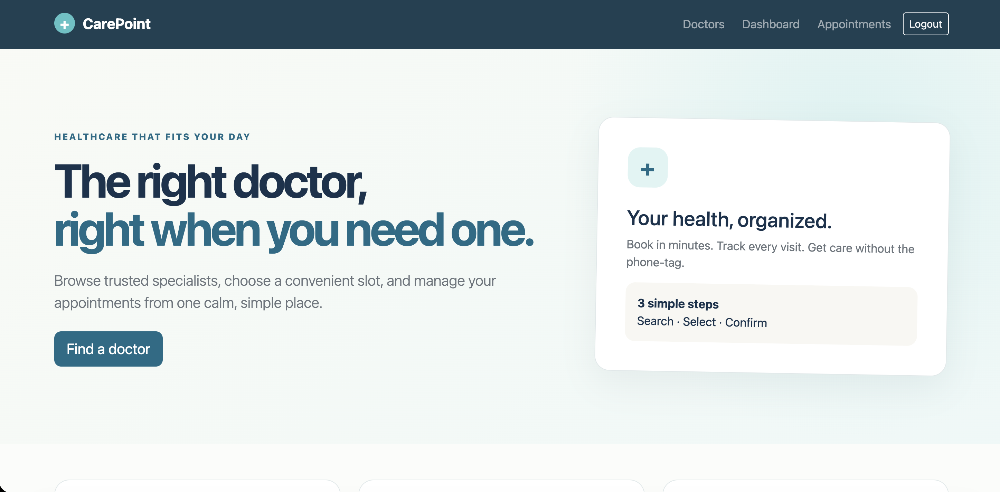
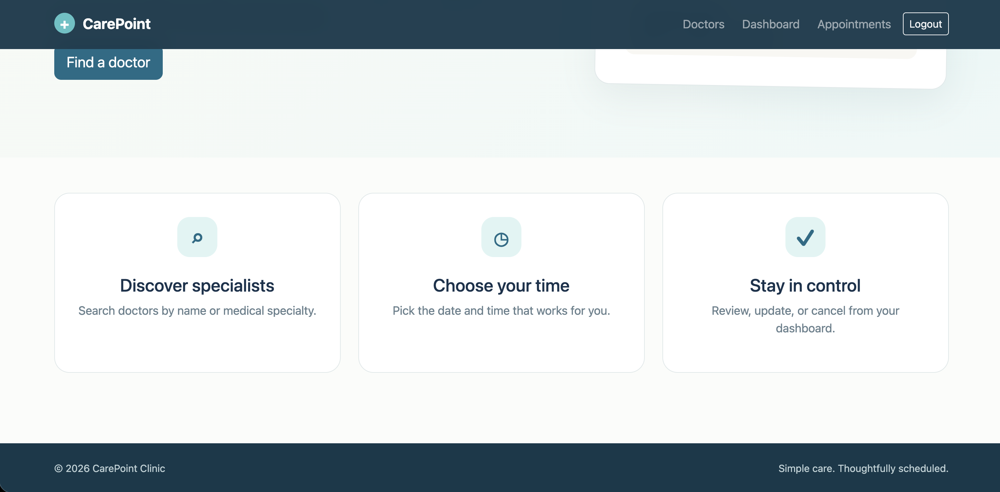
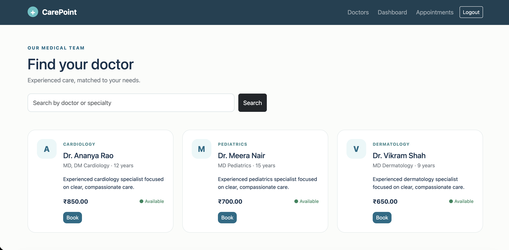
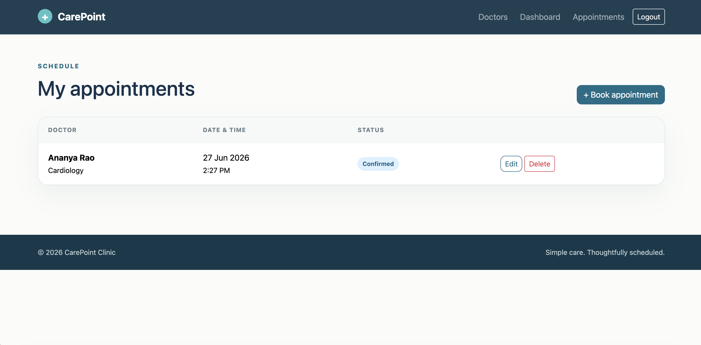
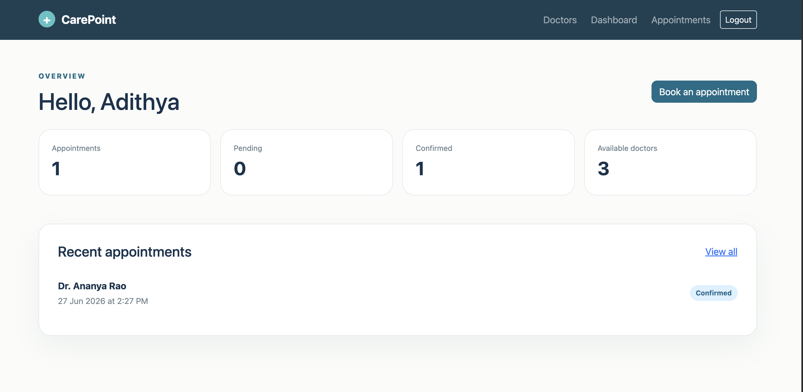
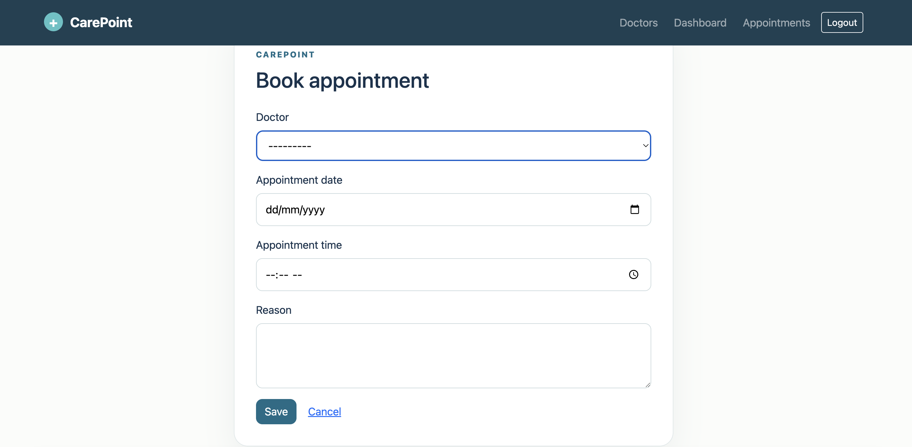

# CarePoint - Doctor Appointment Booking System

A responsive Django application where patients discover doctors and book appointments, staff manage doctors and appointment statuses, and administrators manage users and roles.

## Screenshot









## Features

- Signup, login, and logout with a custom Django user model
- Three roles: Admin, Staff, and Patient
- Full doctor CRUD and appointment CRUD with ownership checks
- Doctor search by name or specialty
- Patient and staff dashboards with live database totals
- Double-booking prevention and past-date validation
- Responsive Bootstrap interface and registered Django admin models
- Automated tests for authentication, CRUD boundaries, and role security

## Project modules

- `accounts` - authentication, roles, and admin-only user management
- `appointments` - doctors, booking workflow, search, and CRUD
- `dashboard` - role-aware reports and recent activity

## Local setup

Python 3.12+ is recommended.

```bash
python3 -m venv .venv
source .venv/bin/activate
pip install -r requirements.txt
python manage.py migrate
python manage.py seed_demo
python manage.py runserver
```

Open `http://127.0.0.1:8000/`.

## Demo credentials

| Role | Username | Password |
|---|---|---|
| Admin | `admin` | `Admin@12345` |
| Staff | `staff` | `Staff@12345` |
| Patient | `patient` | `Patient@12345` |

These are development credentials created by `python manage.py seed_demo`; change them before deployment.

## Useful commands

```bash
python manage.py test
python manage.py createsuperuser
python manage.py makemigrations
python manage.py migrate
```

## Role permissions

| Capability | Patient | Staff | Admin |
|---|:---:|:---:|:---:|
| View/search doctors | Yes | Yes | Yes |
| Book and manage own appointments | Yes | Yes | Yes |
| View all appointments/change status | No | Yes | Yes |
| Create/edit/delete doctors | No | Yes | Yes |
| Manage users and roles | No | No | Yes |
| Django admin panel | No | Optional | Yes |

## Deployment

Before public deployment, set `DEBUG = False`, use environment variables for `SECRET_KEY` and `ALLOWED_HOSTS`, configure PostgreSQL, run `collectstatic`, and replace all demo passwords. A GitHub repository and deployment URL can then be submitted per the project guidelines.
